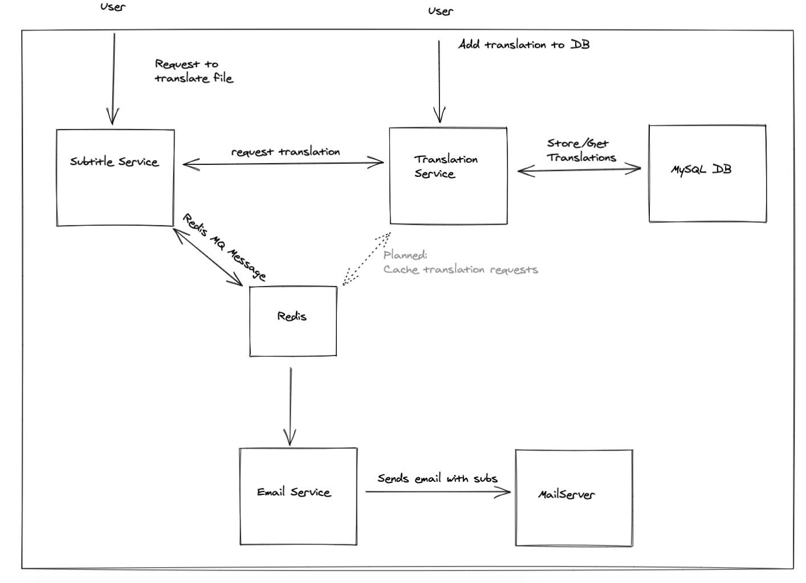

[Click here to check solution details](#solution)

# Coding challenge

Hi Andrei!

Thanks for taking your time to work on this coding challenge.

Ideally this test should take a day or two. But feel free to take as much time as you need. Quality is more important than speed. Latest delivery though is in one week starting now.

This coding challenge will show us some of your skills. And you get to know our work flow as well. The solution of the challenge is not too hard. So you can focus on technology and code. Show us what you got! 😉

## Todo

1. Clone this repo.
2. Create a new development branch.
3. Use as many commits as you can so we can see your progress.
4. After finishing your work, create a Pull Request to the master branch.
5. Be ready to answer question.

## Requirements

- The task must be developed in NodeJS.
- Write tests where applicable/necessary.
- All code as well as documentation or comments must be in english.
- Provide instructions on how to run the project.

## Business description

A Subtitles Translator is a service that translates subtitles, it takes one or several subtitle files as input and produces the subtitles in the same format containing the translations of each one of the contained sentences. The translation is performed by using historical data stored in a [Translation Management System (TMS)](https://en.wikipedia.org/wiki/Translation_management_system). One translation is performed by going through the following steps:

1. Parses the subtitles file and extract the translatable source.
2. Translates the source using historical data.
3. Pairs the result with the source.
4. Reconstructs the subtitles file.

Below you can find an example of how a subtitles file looks like:

```
1 [00:00:12.00 - 00:01:20.00] I am Arwen - I've come to help you.
2 [00:03:55.00 - 00:04:20.00] Come back to the light.
3 [00:04:59.00 - 00:05:30.00] Nooo, my precious!!.
```

Is basically conformed by the id of the line, the time range, and then the content to be translated.

The output for this input would be a file containing something as:

```
1 [00:00:12.00 - 00:01:20.00] Ich bin Arwen - Ich bin gekommen, um dir zu helfen.
2 [00:03:55.00 - 00:04:20.00] Komm zurück zum Licht.
3 [00:04:59.00 - 00:05:30.00] Nein, my Schatz!!.
```

The second part of the system is the aforementioned TMS, as its name states, is a system that stores past translations to be reused, the structure of this system is really simple, it contains two endpoints, one for translating and the other for introducing data.

In order to translate a query, it uses the following flow:

1. Search for strings that are **approximately** equal in the database — They might not be the same but close enough to be consider a translation.
2. It calculates the distance between the query and the closest string found. — A standard way of calculating strings distance is by using [Levenshtein distance algorithm](https://en.wikipedia.org/wiki/Levenshtein_distance).
3. If the distance is less than 5, is considered a translation, otherwise the same query is returned as result.

In order to import data, it uses the following structure:

```json
[
  {
    "source": "Hello World",
    "target": "Hallo Welt",
    "sourceLanguage": "en",
    "targetLanguage": "de"
  },
  {
    "source": "Hello guys",
    "target": "Hallo Leute",
    "sourceLanguage": "en",
    "targetLanguage": "de"
  },
  {
    "source": "I walk to the supermarket",
    "target": "Ich gehe zum Supermarkt.",
    "sourceLanguage": "en",
    "targetLanguage": "de"
  }
]
```

## Task

Your task is:

1. Create a REST API for uploading subtitles in a plain text format (.txt) and send an email with the translation as attachment once the process done.
2. Create the TMS either inside or outside the document translator (however you feel is the best way) with the two endpoints stated before.

Feel free to define yourself the API contracts and the project structure.

## Bonus point

- Creativity.
- Clean code.
- Usage of best practices.
- Usage of Typescript.
- Usage of Docker.

We wish you the best of lucks 🙏!

# Solution

[Intro](#intro)

[How to use](#how-to-use)

[Issues i had](#issues-i-had)

[What i want to do next](#what-i-want-to-do-next)

## Intro

This was one of the most fun challanges i had to work with purely due to the fact that the requirements allow for either a simple solution or a more complex one with different aproaches to consider.
Due to that i was really excited to implement something a bit more complex ( maybe overkill ) for this solution:



## How to use

Ensure you have Docker version 20.10+ installed.

1. In the main project folder run `docker-compose up` or `docker-compose up -d` to run in detached mode
2. Alternatively if you wish to modify the projects and have them restart immediately use `docker-compose -f docker-compose.dev.yaml up --build`
3. After the inital build simply run `docker-compose up` or ``docker-compose -f docker-compose.dev.yaml up`

- to save translation data send a post request to `http://localhost:8100/import-data` with a JSON in the following format:

```
[
  {
    "source": "Hello World",
    "target": "Hallo Welt",
    "sourceLanguage": "en",
    "targetLanguage": "de"
  }
]
```

- To request a translation go to `http://localhost:8070/` select your subtitle file, target language and email address - just make sure there's already translation data saved as indicated in the previous step :)

- To view resulting email and attachment go to `http://localhost:8025/`
  - Click on an email to view message
  - Click on the`MIME` tab where you can download the resulting subtitle

## Issues i had

- I wanted to use Elasticsearch as it had integrated fuzzy search and wanted to try out a new technology. This became a problem since i the learning curve was a bit too high and i couldn't really make it work fast enough. The fuzzy match query also has a strict maximum allowed Levenshtein Edit distance of 2 which would not work considering the requirements of this challange.
  In the end i stuck with MySQL which for a small sample size does the job - i would be curious to see how everything with work with a huge sample size.

- Testing - this is a personal challenge for me as i'm struggling with mocking/stubbing in TS. For example i got stuck trying to mock nodemailer and in the end i had to call it quits as i was running out of time. This is definetly an area where i want to focus on in the future.

- Issues between different TypeORM and ts-node-dev - this ate quite a bit of my time as i couldn't figure out what was going on because of my inexperience with how ts-node-dev actually works.

## What i want to do next

After i make the PR i still want to work on this project as it is a lot of fun

1. Proper logging
2. Finish tests :(
3. More error handling and bugfixes
4. Add translation caching
5. Docker images optimizations
6. NGINX Api Gateway + Swagger
